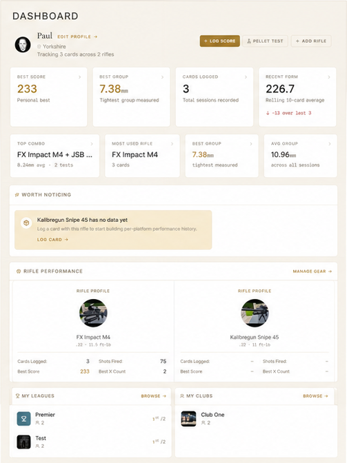
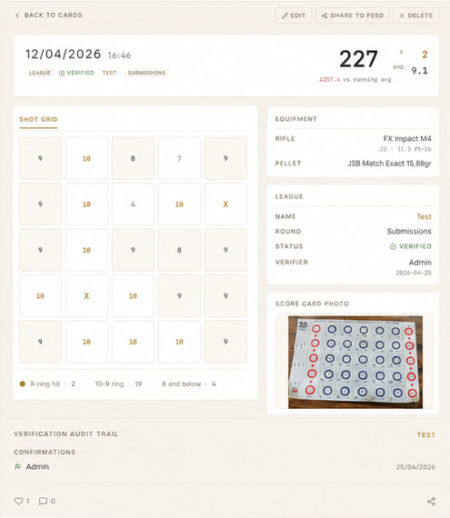
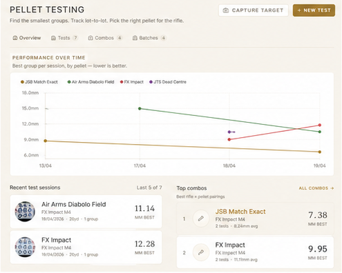
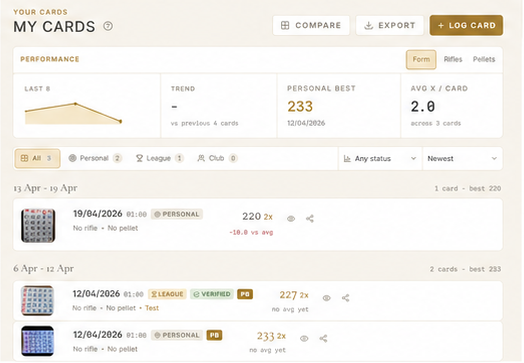
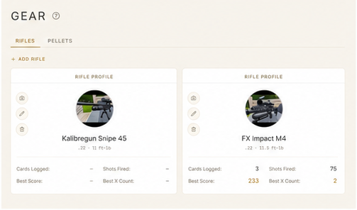
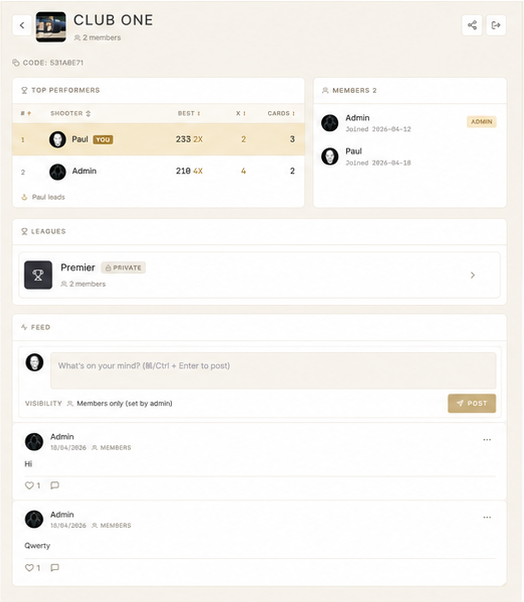
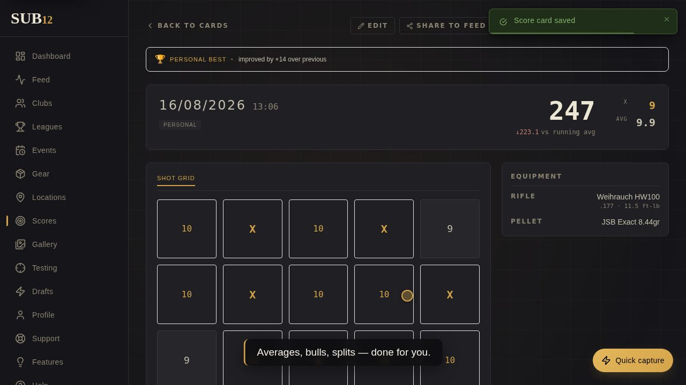
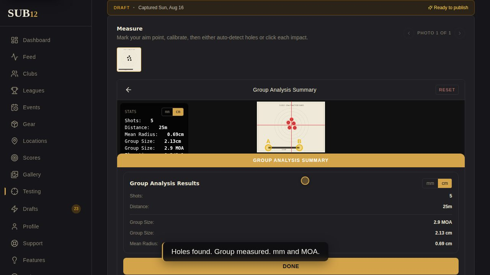
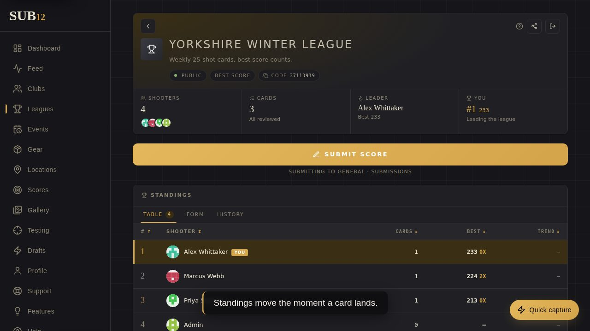
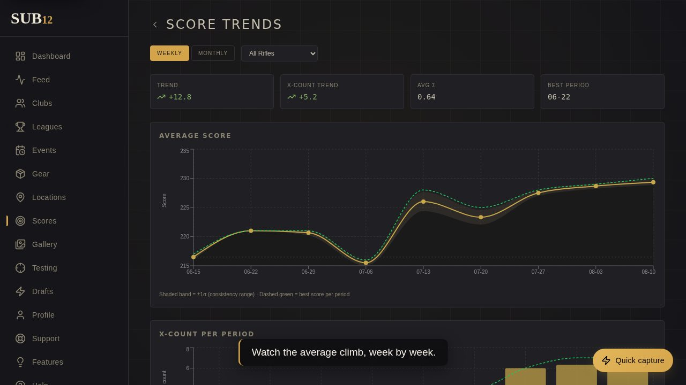

<div align="center">


### Log the card. Run the league. Know what your gear actually does.

An open-source target shooting companion for the UK airgun benchrest community —
25-shot score cards, gear tracking, leagues and clubs, and pellet testing that
measures your groups from a photograph.

[](https://github.com/eyupio/sub12/actions/workflows/ci.yml)
[](https://github.com/eyupio/sub12/actions/workflows/security.yml)
[](https://github.com/eyupio/sub12/actions/workflows/android.yml)
[](LICENSE)
[](backend/go.mod)
[](frontend/package.json)
[](CONTRIBUTING.md)

**[Try it](https://sub12.io)** · **[Install your own](#installation)** ·
**[Android APK](https://github.com/eyupio/sub12/releases/download/android-latest/sub12.apk)** ·
**[Contribute](CONTRIBUTING.md)** · **[Security](SECURITY.md)**

<sub>Developed by **[EyUp.io](https://eyup.io)** · AGPL-3.0 · self-host it, fork it, run it for your club</sub>

</div>

---

## What it does

<table>
<tr>
<td width="50%" valign="top">

**Score cards that survive the evening**

A 25-shot card, captured shot by shot, with target presets and a photo of the
card itself. Then — and this is the part most tools get wrong — the card's
context stays changeable. Shot it against the wrong league? Round filled up
before you submitted? Move it. Nobody re-shoots a card because software filed it
badly.

</td>
<td width="50%" valign="top">

**Pellet testing from a photograph**

Photograph the target, and sub12 finds the holes, measures the group and scores
its own confidence in the reading. Manual placement is there when detection is
wrong. Then compare tins, chart the timeline, run batch reports across
rifle/pellet combinations, and put a result on the public leaderboard.

</td>
</tr>
<tr>
<td width="50%" valign="top">

**Leagues that a volunteer can actually run**

Seasons and rounds get edited far more often than created, so all of it is full
CRUD — rename, re-date, archive, delete. Score verification with member
confirmations, moderator amend/reject, and a complete audit trail. Owners
delegate specific capabilities rather than handing over the keys.

</td>
<td width="50%" valign="top">

**Clubs, events and the people**

Club profiles with a real-world identity — address, map pin, disciplines,
facilities, opening hours. Events other people enter, with delegated scorers and
CSV results. Follows, an activity feed, comments, achievements, and blocks and
mutes that are applied in the query rather than hidden in the client.

</td>
</tr>
</table>

<div align="center">

|  |  |  |
|:--:|:--:|:--:|
|  |  |  |
| **Dashboard** | **Score card capture** | **Pellet testing** |
|  |  |  |
| **Your cards** | **Gear** | **Clubs** |

</div>

<details>
<summary><b>The full feature list</b></summary>

### Scoring & gear
- 25-shot cards with per-shot entry, target presets, image attachments and drafts
- A card's context (personal / league / club / event) is changeable after capture
- Rifle and pellet inventories with images, plus built-in catalogs of common models
- Opt-in anonymised gear comparison — your make and model against everyone else's,
  suppressed entirely below three contributing owners
- Personal trends, rifle-specific stats and historical charts
- A gallery of every photo you've uploaded, with submit and withdraw actions

### Pellet testing
- Image-based group measurement with automatic hole detection
- Manual hole placement when detection gets it wrong
- Per-test confidence scoring, so a bad photo reads as a bad photo
- Compare, timeline, batch reports and combo analytics across pellets and rifles
- Public leaderboard, no login required
- Ballistics helpers for downrange calculations

### Leagues
- Seasons and rounds with full CRUD; archiving retires a season that's been shot
- Standings, configurable scoring, join requests
- Score verification: member confirmations, moderator verify / amend / reject /
  reopen, with an audit trail
- Delegated moderator capabilities — the owner grants specific duties, and a
  control the grant doesn't cover is drawn read-only with the reason

### Clubs & events
- Club profiles: postal address, map pin, disciplines, distances, facilities,
  membership and visitor info, opening hours
- A club's authority reaches the leagues it hosts
- Events addressed by slug, with participants, guests, invitations, delegated
  scorers, scoreboard and `results.csv`

### Social & moderation
- Follow / unfollow, activity feed, posts, comments, likes, achievements
- Blocks and mutes applied inside the feed query, symmetrically
- Reports on posts, comments and users; an admin decision queue; a background
  sweeper that gives the author a grace period to amend first
- Group announcements from leagues, clubs, events and the platform

### Notifications
- One row per recipient, delivered in-app, by push and by email — each gated on
  the recipient's own preference
- Validation requests go to whoever can actually act, with volunteers able to opt
  in to reviewing other shooters' cards

### Accounts
- Email/password with JWT sessions and refresh tokens
- TOTP two-factor with bcrypt-hashed backup codes
- Password reset, avatar upload, email change

### Admin
- Users, leagues, clubs, events, gear analytics, FAQ, categories, feature board
- SMTP settings and an email template editor with live preview
- Sitemap & SEO reporting with IndexNow submission
- Encrypted S3 backups — a run without a passphrase fails rather than uploading
  plaintext
- Activity simulation for populating a demo instance

### Platform
- Installable PWA, offline-aware, with a queued score outbox
- Native iOS and Android shells from the same bundle: share sheet, camera,
  geolocation, deep links, push, haptics
- Dark mode, and a design system with motion tokens and a `prefers-reduced-motion`
  guard

</details>

## See it in action

Short recordings of the real app, narration baked into the frames. Click a poster
to watch:

| | |
|---|---|
| [](https://sub12.io/demos/showcase-score-card.webm) **A 25-shot card, start to finish** — capture, totals, stats | [](https://sub12.io/demos/showcase-pellet-testing.webm) **Photograph the target, read the group** — hole detection, group size, leaderboard |
| [](https://sub12.io/demos/showcase-league.webm) **Your league, live standings** — standings that move when a card is verified | [](https://sub12.io/demos/showcase-analytics.webm) **Know exactly what's working** — trends, averages and gear comparisons |

How-to guides: [add your rifle and pellets](https://sub12.io/demos/howto-add-gear.webm)
· [log your first score card](https://sub12.io/demos/howto-first-card.webm)
· [join a league and submit a card](https://sub12.io/demos/howto-join-league.webm)
· [run a league](https://sub12.io/demos/howto-run-league.webm)
· [test pellets](https://sub12.io/demos/howto-pellet-test.webm)

None of these are edited by hand — every one is re-recorded with
`./scripts/record-demos.sh` whenever the UI it shows changes.
[docs/demo-recordings.md](docs/demo-recordings.md) is the production standard and
storyboard catalog.

## Installation

One command, and it will ask you what you want:

```bash
git clone https://github.com/eyupio/sub12.git
cd sub12
./scripts/install.sh
```

The installer checks your prerequisites, **generates real secrets** (never the
placeholders in `.env.example` — those are public now, see
[Security](#security)), writes `.env` with mode 600, prepares the backup
directory with the ownership the container needs, runs migrations and waits until
the stack answers. It offers three modes:

| Mode | What you get | Who it's for |
|---|---|---|
| **Local development** | Postgres + Redis in Docker; you run the Go API and Vite yourself, with hot reload and seed data | Changing the code |
| **Self-host** | The whole stack from published container images | Running it for your club |
| **Self-host, from source** | Same, but images built from your checkout | You've changed something, or you want to verify the build |

Useful flags:

```bash
./scripts/install.sh --check                        # prerequisites only, changes nothing
./scripts/install.sh --mode dev --seed --yes        # unattended dev setup
./scripts/install.sh --mode self-host \
    --site-url https://shoot.myclub.org --port 3000 --yes
./scripts/install.sh --no-start                     # write config, start nothing
```

Re-running it is safe: every secret already in your `.env` is preserved, not
rotated, and the old file is backed up.

On Windows, run it under WSL2 — which Docker Desktop needs anyway. There is no
PowerShell installer yet; the manual steps below work from any shell.

### Prerequisites

| | Needed for |
|---|---|
| [Docker](https://docs.docker.com/get-docker/) + Compose v2 | All modes — Postgres and Redis |
| [Go 1.25+](https://go.dev/dl/) | Local development only |
| [Node 20+](https://nodejs.org/) | Local development only |
| `curl`, `make`, `openssl` | Health checks, migrations, secret generation |

### Doing it by hand

<details>
<summary><b>Local development, manually</b></summary>

```bash
cp .env.example .env                       # then edit it
make dev                                   # Postgres + Redis
cd backend && make migrate-up              # schema
cd backend && make seed                    # optional: test accounts and data
cd backend && make run                     # API on :8080
cd frontend && npm install && npm run dev  # app on :5173
```

Seeded accounts, development only:

| Email | Password | Role |
|---|---|---|
| `dev@sub12.local` | `password123` | User |
| `admin@sub12.local` | `password123` | Admin |

</details>

<details>
<summary><b>Full Docker stack, manually</b></summary>

```bash
cp .env.example .env
# Edit .env: set a real JWT_SECRET and DB_PASSWORD, set SITE_URL,
# set ENV=production. The backend refuses to start otherwise — see Security.

mkdir -p ./data/backups
sudo chown 10001:10001 ./data/backups && sudo chmod 750 ./data/backups

docker compose up -d
docker compose logs backend   # a rejected config value is printed at startup
```

The backend container runs as UID 10001 and writes AES-encrypted backup archives
to `/var/lib/sub12/backups`, bind-mounted to `./data/backups`. Pre-creating that
directory with the right ownership is what lets admin backup runs succeed —
without it they fail with `mkdir /var/lib/sub12: permission denied`, which you'd
rather not discover at the moment you need a backup.

</details>

<details>
<summary><b>Running it behind a reverse proxy</b></summary>

The frontend container serves the SPA and proxies `/api/` to the backend
internally, so it is the only upstream your proxy needs. The backend port is
never published to the host.

```
your proxy (TLS) ──▶ localhost:${WEB_PORT:-3000} ──▶ frontend:8080 ──▶ backend:8080
```

Set `SITE_URL` to the URL people actually visit. Every link sent by email or push
is built from it, and `PASSWORD_RESET_URL`, `EVENT_INVITATION_URL` and
`DEFAULT_AVATAR_URL` are all derived from it — so one setting retargets the lot.
Set `CORS_ORIGIN` to the same value.

Forks running their own images set `IMAGE_REPO=ghcr.io/your-org` rather than
editing `docker-compose.yml`.

</details>

### Upgrading

```bash
docker compose pull && docker compose up -d
```

Migrations run on startup and are idempotent. Check `docker compose logs backend`
afterwards.

## Security

sub12 handles accounts, uploads and a public API, so a few things are worth
stating plainly. The full picture is in **[SECURITY.md](SECURITY.md)**, including
how to report a vulnerability privately — please don't open a public issue for
one.

**The placeholders in `.env.example` are public.** They always were in spirit;
now the repository is open they demonstrably are. A deployment that keeps the
example `JWT_SECRET` can have tokens forged against it by anyone who reads this
repo — including admin tokens, with no password and no login involved. So the
backend **refuses to start** in `ENV=production` when it finds:

- a `JWT_SECRET` or `DB_PASSWORD` that is one of the published placeholders, or a
  `JWT_SECRET` shorter than 32 characters
- `DB_SSLMODE` allowing an unencrypted connection, unless you set
  `DB_ALLOW_INSECURE_LOCAL_NETWORK=true` to state that the database isn't
  reachable off-host — which is true of the shipped Compose topology and not of a
  managed database somewhere else
- a `CORS_ORIGIN` that is `*`, empty, or pointing at localhost
- a weak `ADMIN_PASSWORD` while `SEED_ADMIN=true`
- any user-facing URL still pointing at localhost

It reports every problem at once rather than one per restart. If you see that
error, the guard is working — `./scripts/install.sh` produces a config that
passes it.

**What we do already:** bcrypt password hashing, TOTP two-factor, per-IP rate
limiting on every password-bearing endpoint, parameterised SQL throughout, a
`script-src 'self'` CSP with HSTS in production, non-root containers, and CodeQL
+ `govulncheck` + `npm audit` + secret scanning in CI.

```bash
make security   # govulncheck and npm audit, the same as CI runs
```

## Architecture

```
┌──────────────┐        ┌──────────────┐        ┌──────────────┐
│  React PWA   │        │   Go API     │        │ PostgreSQL 16│
│  Capacitor   │──HTTP──▶│  Chi + pgx   │────────▶│  + Redis 7   │
│  iOS/Android │        │              │        │              │
└──────────────┘        └──────┬───────┘        └──────────────┘
                               │
                     ┌─────────┴─────────┐
                     │ SMTP · FCM push   │
                     │ S3 backups · OG   │
                     │ image rendering   │
                     └───────────────────┘
```

The backend is strictly layered — **handler → service → repository**. Handlers
write HTTP responses, services hold business logic and return domain errors,
repositories run pgx queries. No ORM.

```
backend/
  cmd/api/                  entrypoint
  internal/
    api/handler/            HTTP handlers, one file per domain (~45)
    api/middleware/         auth (JWT → context), logging, rate limiting
    api/router.go           every route in the API, in one file
    config/                 env-based config + production Validate()
    db/migrations/           sequential SQL, embedded and run on startup
    model/                   domain types, plus the pure rules worth unit-testing
    repository/             pgx data access, one file per domain (~40)
    service/                business logic, one file per domain (~44)
frontend/
  src/
    api/                    typed fetch wrappers, one per domain
    components/             shared UI plus per-feature subfolders
    pages/                  route pages (~88)
    routeTree.tsx           the one route tree — public vs authed lives here
    store/                  Zustand: auth, theme, toast, navigation
    utils/                  ballistics, hole detection, share, push, routing
e2e/                        Playwright suite
docs/                       long-form design notes
scripts/                    install, mobile build, e2e, demo recording
```

`__tests__/` folders sit next to the code they cover.

**[CLAUDE.md](CLAUDE.md) is the single source of truth** for architecture and
conventions — including the reasons behind rules that look arbitrary until you
know the outage that produced them. Read it before a substantial change.

### Stack

| Layer | Technology |
|---|---|
| Backend | Go 1.25, Chi v5, pgx v5, zerolog, golang-jwt v5, go-redis v9 |
| Database | PostgreSQL 16 with golang-migrate (embedded SQL) |
| Cache | Redis 7 |
| Frontend | React 18, TypeScript 5.5, Vite 5, TanStack Router + Query, Zustand 4 |
| Styling | Tailwind CSS v3, Lucide icons, Recharts |
| Mobile | Capacitor 6 (iOS / Android), PWA via vite-plugin-pwa |
| Also | `fogleman/gg` renders share cards, `pquerna/otp` backs 2FA, `minio-go` ships encrypted backups |
| Testing | Go test + testify, Vitest + Testing Library, Playwright |
| CI/CD | GitHub Actions → GHCR images |

## Development

```bash
make check      # everything the PR gate runs
make security   # govulncheck + npm audit
make help       # all targets
```

Or by hand:

```bash
cd backend  && make test    # go test -race -count=1 ./...
cd backend  && make lint    # go vet ./...
cd frontend && npm run check && npm run lint && npm test && npm run build
```

Two things that catch people:

- **`npm run check` is `tsc -b`, not `tsc --noEmit`.** The root `tsconfig.json` is
  a solution file with `"files": []`, so `tsc --noEmit` resolves no inputs and
  exits 0 on any codebase, however broken. Only build mode follows the project
  references.
- **Backend tests that need a database skip silently unless `DB_HOST` is set.**
  `make dev` gives you one. Without it, a green run may have skipped exactly the
  tests covering your change.

The Playwright suite is **not** in the PR gate. Run it yourself when you touch
score capture, leagues, events or clubs — `./scripts/e2e.sh`, or see
[E2E_TESTING.md](E2E_TESTING.md).

### Database migrations

```bash
cd backend
make migrate-create NAME=add_foo   # picks the next sequence number for you
make migrate-up
make migrate-down
make migrate-lint                  # duplicate prefix check, as CI does
```

Always use `make migrate-create` — never hand-write the file. All DDL must be
idempotent (`IF NOT EXISTS`, `ON CONFLICT DO NOTHING`,
`EXCEPTION WHEN duplicate_object`), every `.up.sql` needs a `.down.sql` that
fully reverses it, and one concern per migration. These rules exist because we've
had production outages from migration conflicts.

## Configuration

Two variables are required: `DB_PASSWORD` and `JWT_SECRET`. Everything else has a
default.

The one worth understanding is **`SITE_URL`** — the canonical public host.
`PASSWORD_RESET_URL`, `EVENT_INVITATION_URL` and `DEFAULT_AVATAR_URL` are all
derived from it when unset, so one change retargets every link sent by email or
push.

See [`.env.example`](.env.example) for the annotated list and
[CLAUDE.md](CLAUDE.md#environment-variables) for every variable and its default.

## Mobile apps

The web build and the native iOS / Android apps ship from one codebase — the same
`frontend/dist/` bundle wrapped by [Capacitor 6](https://capacitorjs.com/).

```bash
cd frontend
npm run build:mobile     # tsc -b && vite build && cap sync
npm run run:android      # build + launch on emulator/device
npm run run:ios          # macOS only
```

Android APKs are built in CI and published to a rolling pre-release, so the
download link never changes:

```
https://github.com/eyupio/sub12/releases/download/android-latest/sub12.apk
```

| Trigger | Variant | Where it lands |
|---|---|---|
| Pull request | debug | Workflow artifact |
| Push to `main` | release | Rolling `android-latest` pre-release + artifact |
| Tag `v*` | release | Attached to that version's Release |

`VITE_ANDROID_APK_URL` retargets that link for forks and staging builds; a fork
that modifies the code should also set `VITE_SOURCE_URL` so the footer's Source
link points at its own repository.

<details>
<summary><b>What the native shell adds over the PWA</b></summary>

- **API + share hosts** — a native WebView is served from a local origin, so API
  calls and user-facing links target the canonical host instead
  (`VITE_API_URL`, `VITE_SITE_URL`)
- **Native share sheet** — Android WebViews don't expose `navigator.share`
- **Native camera and photo picker** for target capture
- **Native geolocation** for tagging cards and pellet tests
- **Deep linking** — `https://sub12.io/...` opens the matching in-app screen
- **Push notifications** via FCM; set `FCM_CREDENTIALS_JSON` to enable delivery
- **Auth** — the `SameSite=Lax` refresh cookie isn't delivered cross-site from a
  WebView, so native persists the refresh token and passes it explicitly
- **Native chrome** — status bar, splash, safe areas, Android back button, and
  the service worker skipped to avoid serving a stale shell after an app update
- **Haptics** on nav, tabs, the capture FAB, likes and toasts

**Signing matters.** Android identifies an installed app by (package name,
signing certificate), so a key that changes between builds makes every new APK
refuse to install over the last one — and the phone silently carries on running
the build it already has. Set `ANDROID_KEYSTORE_BASE64`,
`ANDROID_KEYSTORE_PASSWORD`, `ANDROID_KEY_ALIAS` and `ANDROID_KEY_PASSWORD` to
sign with a stable release key. Without them CI mints one and reuses it from the
Actions cache; a cache eviction rotates it, so the release notes carry the
signer's SHA-256 fingerprint.

iOS needs a paid Apple Developer membership to produce an installable build.
Without signing secrets the workflow archives unsigned as a compile check only.

See [frontend/README.md](frontend/README.md) for prerequisites and the full asset
workflow.

</details>

## Contributing

Contributions are genuinely welcome — and a bug report from the range is as
useful as a pull request.

- **[CONTRIBUTING.md](CONTRIBUTING.md)** — setup, conventions, what gets flagged
  in review
- **[CODE_OF_CONDUCT.md](CODE_OF_CONDUCT.md)** — how we treat each other
- **[CLAUDE.md](CLAUDE.md)** — architecture and the reasoning behind it
- **[CHANGELOG.md](CHANGELOG.md)** — what's changed

Good first steps: [open issues](https://github.com/eyupio/sub12/issues),
documentation fixes, or testing an APK on a device you own and telling us what
broke.

## Licence

**GNU Affero General Public License v3.0** — see [LICENSE](LICENSE).

You may run, study, modify and redistribute sub12 freely. The one obligation
worth knowing about: AGPL section 13 means that if you run a **modified** sub12 as
a network service, you must offer its source to the people using it over that
network. That's why the app footer carries a **Source** link — a fork should point
`VITE_SOURCE_URL` at its own repository rather than removing it.

Brand assets in [`brand/`](brand/README.md) — the SUB12 name, logo and reticle —
are not covered by the code licence. Fork the software freely; please give your
fork its own name and mark.

---

<div align="center">

**Developed by [EyUp.io](https://eyup.io)**

<sub>Built for shooters, with shooters. If sub12 is useful to your club, a ⭐ helps other people find it.</sub>

</div>
